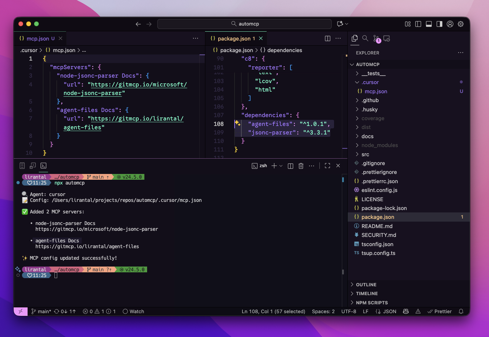

<!-- markdownlint-disable -->

<p align="center"><h1 align="center">
  automcp
</h1>

<p align="center">
  AutoMCP detects your package manifest file and automatically adds relevant MCP (Model Context Protocol) servers to the coding agents it detects
</p>

<p align="center">
  <a href="https://www.npmjs.org/package/automcp"></a>
  <a href="https://www.npmjs.org/package/automcp"></a>
  <a href="https://www.npmjs.org/package/automcp"></a>
  <a href="https://github.com/lirantal/automcp/actions/workflows/ci.yml"></a>
  <a href="https://codecov.io/gh/lirantal/automcp"></a>
  <a href="./SECURITY.md"></a>
</p>




## Features

- 🔍 **Auto-detects** your coding agent (Cursor, VS Code, Claude Desktop)
- 📦 **Scans** your project dependencies from package.json
- 🔗 **Resolves** each package to its GitHub repository
- 🌐 **Generates** GitMCP server URLs automatically
- ✅ **Never overwrites** existing MCP server configurations
- 🚫 **Prevents duplicates** via smart URL normalization
- 🏃 **Fast** concurrent resolution with connection pooling
- 🧪 **Dry-run mode** to preview changes safely
- 🎯 **Zero runtime dependencies** — uses only Node.js built-ins

## Install

You can run `automcp` with npx (no install required) or add it to your project.

```sh
npx automcp
# or
npm add -D automcp
```

## Usage: CLI

<https://github.com/user-attachments/assets/305f75f8-0fec-4dd2-886c-d5f23a5e8a7e>

```sh
npx automcp [options]
```

### Options

- `--dry-run`: Show planned changes without writing
- `--agent <name>`: Override detected agent (e.g., cursor, vscode)
- `--config <path>`: Override MCP config file path
- `--include-dev`: Include devDependencies (default: false)
- `--silent`: Minimal output
- `--json`: JSON summary output
- `-h`, `--help`: Show help
- `-v`, `--version`: Show version

### Examples

```sh
# Preview changes only
npx automcp --dry-run

# Explicitly target Cursor and a custom config path
npx automcp --agent cursor --config ~/.cursor/mcp.json

# Include devDependencies
npx automcp --include-dev

# JSON output for CI/automation
npx automcp --json
```

### Understanding `--agent` and `--config` Flags

The `--agent` and `--config` flags are **flexible and work independently or together**. You don't need to provide both!

#### Usage Patterns

| Command | Agent Detection | Config Path | When to Use |
|---------|----------------|-------------|-------------|
| `npx automcp` | Auto-detected from `.cursor/` or `.vscode/` | Auto-detected | ✅ **Recommended:** Let AutoMCP detect everything |
| `npx automcp --agent cursor` | Use "cursor" | Auto-resolves to `.cursor/mcp.json` | When you have multiple agents and want to target one |
| `npx automcp --config /path/to/mcp.json` | Inferred from path | Use specified path | When config is in a custom location |
| `npx automcp --agent cursor --config /custom/path.json` | Use "cursor" | Use specified path | Full manual control |

#### How Each Flag Works

**Using `--agent` alone:**
- Resolves the config path automatically based on the agent name
- `cursor` → `.cursor/mcp.json` in your project
- `vscode` → `.vscode/mcp.json` in your project
- Creates the file if it doesn't exist

**Using `--config` alone:**
- Infers the agent name from the path
- Path contains "cursor" → agent = "cursor"
- Path contains "vscode" → agent = "vscode"
- Path contains "claude" → agent = "claude-desktop"
- Otherwise → agent = "unknown"

**Using both together:**
- Explicitly sets both values with no auto-detection
- Useful for custom setups or non-standard paths

#### Examples

```sh
# Let AutoMCP detect both (most common)
npx automcp

# Target Cursor specifically, auto-resolve config path
npx automcp --agent cursor

# Use a custom config path, agent inferred as "cursor"
npx automcp --config ~/.cursor/mcp.json

# Use a custom config path, agent inferred as "unknown"
npx automcp --config /tmp/my-mcp-config.json

# Explicitly set both for full control
npx automcp --agent cursor --config /custom/location/mcp.json
```

### How It Works

1. **Detects your coding agent** (Cursor, VS Code) and locates its **local project** MCP config file
2. **Reads your package.json** dependencies
3. **Resolves each dependency** to its GitHub repository via `npm view`
4. **Builds GitMCP URLs** in the format `https://gitmcp.io/owner/repo`
5. **Updates your MCP config** without overwriting existing entries or creating duplicates

> **Note:** AutoMCP only updates local project configurations (e.g., `.cursor/mcp.json` or `.vscode/mcp.json` in your project directory). It does not modify global agent configurations in your home directory.

## Quick Start

```sh
# Run in your project directory
cd my-project
npx automcp

# Preview changes first
npx automcp --dry-run

# Include devDependencies
npx automcp --include-dev
```

### Real-World Example

Given a project with these dependencies:

```json
{
  "dependencies": {
    "express": "^4.18.0",
    "lodash": "^4.17.21",
    "axios": "^1.6.0"
  }
}
```

Running `npx automcp` will:

1. Detect your agent (e.g., Cursor at `.cursor/mcp.json` in your project)
2. Resolve GitHub repos:
   - express → expressjs/express
   - lodash → lodash/lodash
   - axios → axios/axios
3. Add to your MCP config:

```json
{
  "mcpServers": {
    "express Docs": {
      "url": "https://gitmcp.io/expressjs/express"
    },
    "lodash Docs": {
      "url": "https://gitmcp.io/lodash/lodash"
    },
    "axios Docs": {
      "url": "https://gitmcp.io/axios/axios"
    }
  }
}
```

### Supported Agents

AutoMCP looks for agent configurations in the following locations:

- **Cursor** — `.cursor/mcp.json` (in your project directory)
- **VS Code** — `.vscode/mcp.json` (in your project directory)

Use `--agent` and `--config` flags to override auto-detection or to specify a custom config location.

> **Important:** AutoMCP only updates local project configurations. If no local agent configuration is found (e.g., no `.cursor/` or `.vscode/` directory in your project), the tool will exit without making changes. This prevents accidental updates to global configurations.

### Troubleshooting

**Agent not detected**
```sh
npx automcp --agent cursor --config ~/.cursor/mcp.json
```

**Permission errors**
Ensure you have write access to the MCP config directory.

**Non-GitHub packages skipped**
Only packages with GitHub repositories are supported. Packages without a `repository` field or with non-GitHub URLs will be skipped.

**URL resolution timeouts**
The CLI runs `npm view` with a 10-second timeout per package. Slow network or large dependency lists may take time.

### Output Example

**Standard output:**
```
🔍 Agent: cursor
📝 Config: /Users/username/.cursor/mcp.json

✅ Added 3 MCP servers:

   • express Docs
     https://gitmcp.io/expressjs/express

   • lodash Docs
     https://gitmcp.io/lodash/lodash

   • axios Docs
     https://gitmcp.io/axios/axios

✨ MCP config updated successfully!
```

**With dry-run:**
```
🔍 Agent: cursor
📝 Config: /Users/username/.cursor/mcp.json
🧪 Dry-run mode: no files will be modified

✅ Added 5 MCP servers:

   • express Docs
     https://gitmcp.io/expressjs/express

   • lodash Docs
     https://gitmcp.io/lodash/lodash

💡 Run without --dry-run to apply these changes.
```

**With duplicates:**
```
🔍 Agent: cursor
📝 Config: /Users/username/.cursor/mcp.json

⏭️  Skipped 2 duplicates:

   • express Docs
     https://gitmcp.io/expressjs/express

   • lodash Docs
     https://gitmcp.io/lodash/lodash
```

**JSON output (for CI/automation):**
```sh
npx automcp --json
```
```json
{
  "ok": true,
  "result": {
    "added": 3,
    "skipped": 0,
    "errors": 0,
    "addedServers": [
      {
        "name": "express Docs",
        "url": "https://gitmcp.io/expressjs/express"
      }
    ],
    "skippedServers": [],
    "configPath": "/Users/username/.cursor/mcp.json",
    "agentName": "cursor",
    "dryRun": false
  }
}
```

## Node.js Compatibility

- **Requires:** Node.js >= 22.0.0
- Uses ES2022+ features and Node.js built-in APIs
- No external runtime dependencies

## CI/CD Integration

Use `--json` and `--silent` flags for automation:

```yaml
# GitHub Actions example
- name: Update MCP config
  run: |
    npx automcp --json --silent > result.json
    cat result.json
```

Exit codes:
- `0`: Success (including when nothing to add)
- `1`: Fatal error (config parse failure, permission denied, missing package.json)

## Contributing

Please consult [CONTRIBUTING](./.github/CONTRIBUTING.md) for guidelines on contributing to this project.

## Author

**automcp** © [Liran Tal](https://github.com/lirantal), Released under the [Apache-2.0](./LICENSE) License.
